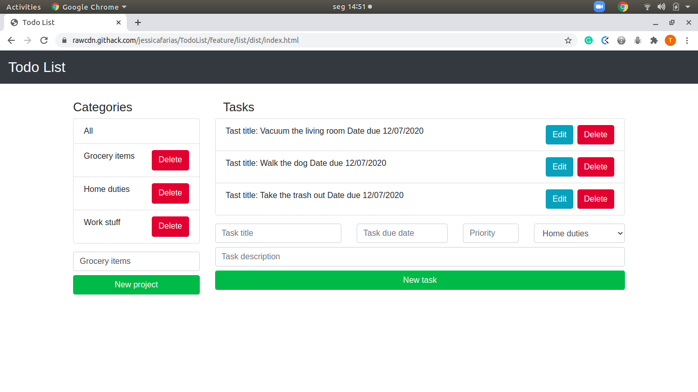

# Todo List Project

#### Welcome to our Todo List Project. The purpose here is to create a tasks manager application.

#### Features
- Create new categories of tasks;
- Create new tasks for each of those categories;
- Index all of the tasks of all of the categories;
- Delete and edit tasks;
- Delete categories;
- Use Jest for testing modules.

#### Screenshot

#### Livedemo
- [GitHub Pages](https://jessicafarias.github.io/TodoList/)

## Getting started
- run `git clone https://github.com/jessicafarias/todolist.git`;
- run `npm install` at the root of the project;
- run `npx webpack` at the root of the project;
- go to `../dist`;
- open `index.html` with you favorite browser.

## Authors
👤 This is us:

- [Jessica Farias](http://jessicafarias.me)

- [Tadeu A Sarro](https://tadeuasarro.web.app)

## Contributing

Contributions, issues and feature requests are welcome!

Feel free to check the [issues page](https://github.com/jessicafarias/todolist/issues)

## Show your support

Give a star if you like this project!

## 📝 License

This project is MIT licensed.